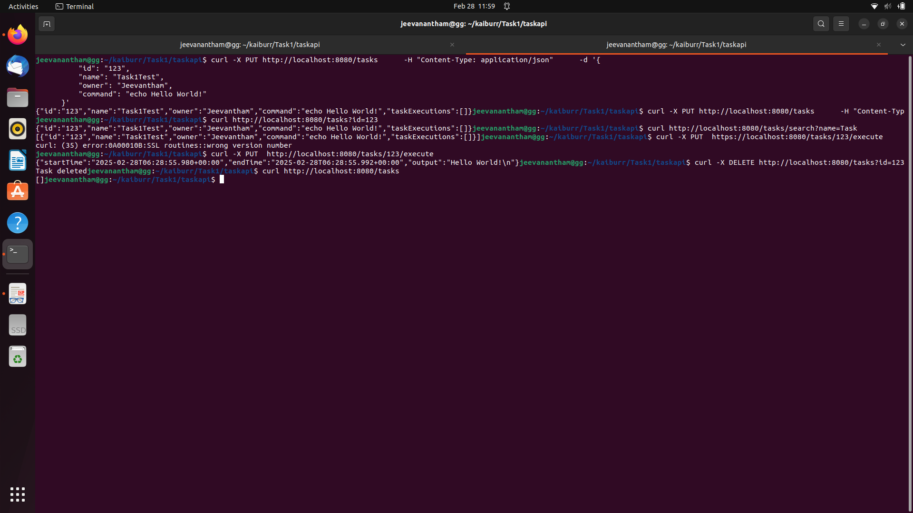

# Task API Project

This is a Spring Boot Java application that provides a REST API for managing and executing "Task" objects stored in MongoDB. Each Task represents a shell command that can be executed (simulated here) an>

https://github.com/user-attachments/assets/06021baf-9eeb-48c3-8297-17e635b556d7
## Features

- **CRUD Operations for Tasks:**
  - **GET /tasks:** Returns all tasks or a specific task if an ID parameter is provided.
  - **PUT /tasks:** Creates or updates a task after validating its command.
  - **DELETE /tasks:** Deletes a task by its ID.
  - **GET /tasks/search:** Searches tasks by a partial name match.
- **Task Execution:**
  - **PUT /tasks/{id}/execute:** Executes the task's shell command and stores the execution details (start time, end time, output).

## Prerequisites

- **Java JDK 11** (or later)
- **Maven** for building the project
- **MongoDB:** Installed and running locally

## MongoDB Setup

If MongoDB is not running as a service, you can start it manually:

1. **Create a data directory for MongoDB:**

   ```bash
   mkdir -p ~/mongodb-data
2. **Start MongoDB using the created directory:**
   ```bash
   mongod --dbpath ~/mongodb-data

## Setup and Build Instructions

1. **Build the Project:**

    In the project root (where pom.xml is located), run:
    ```bash
    mvn clean install

2. **Run the Application:**

    You can run the application using either of the following methods:

    1. ***Using Maven***
        ```bash
        mvn spring-boot:run

    2. ***Using the Packaged JAR***

        After building the project, run:
        ```bash
        java -jar target/taskapi-0.0.1-SNAPSHOT.jar
        


The application will start on port 8080.


## API Usage

**Base URL**
`http://localhost:8080`

**Endpoints**

1. **Get All Tasks or a Specific Task**

   `GET /tasks`
   
   `GET /tasks?id={taskId}`

2. **Create or Update a Task**
   `PUT /tasks`
   **Request Body Example (JSON):**
   ```json
   {
     "id": 1,
     "title": "Task Title",
     "description": "Task Description",
     "status": "pending"
   }
3. **Delete a Task**

   `DELETE /tasks?id={taskId}`

4. **Search Tasks by Name**

   `GET /tasks/search?name={searchString}`

5. **Execute a Task**

   `PUT /tasks/{id}/execute`
   
   **Description:** This endpoint executes the task's shell command and returns execution details (start time, end time, output).



