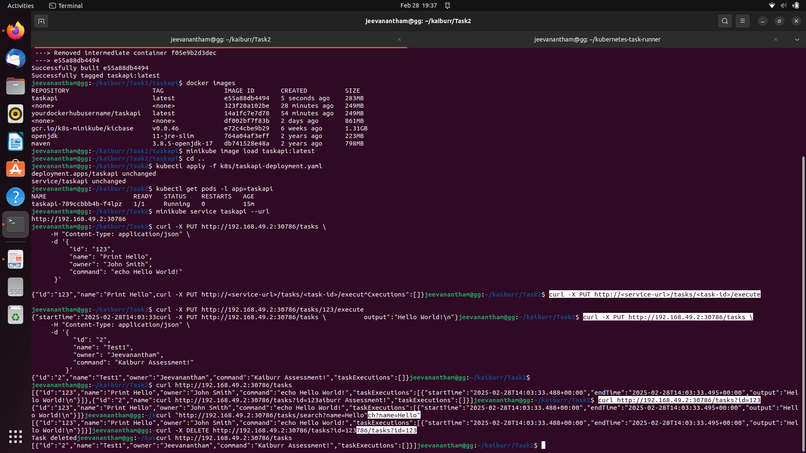

# Task2: Kubernetes Deployment of Task API Application

This project demonstrates the deployment of the Task API application (developed in Task1) to a Kubernetes cluster (using Minikube). The application (a Spring Boot REST API) is dockerized and deployed along with MongoDB. The API has been modified so that the "PUT a TaskExecution" endpoint creates a busybox pod in Kubernetes to execute the task's command.

https://github.com/user-attachments/assets/c1d48c92-6007-488c-8875-a92101c9cc62
---

## Folder Structure

```
kaiburr/
├── Task1/
│   ├── taskapi/         # The Task API application (Spring Boot)
│   │   ├── Dockerfile   # Dockerfile for the application
│   │   ├── pom.xml
│   │   ├── src/
│   │   └── target/      # Compiled JAR goes here after Maven build
│   └── k8s/             # Kubernetes manifests for MongoDB and Task API
│       ├── mongo-pv-pvc.yaml
│       ├── mongo-deployment.yaml
│       └── taskapi-deployment.yaml
└── README.md            # This file
```

---

## Prerequisites

- **Maven** (to compile the Java application)
- **Docker** (to build the Docker image)
- **Minikube** (for running a local Kubernetes cluster)
- **kubectl** (to manage your Kubernetes resources)

---

## Steps to Compile, Build, and Deploy

### 1. Compile the Task API Application

1. Open a terminal and navigate to the application directory:

   ```bash
   cd Task1/taskapi
   ```

2. Run Maven to compile and package the application:

   ```bash
   mvn clean install
   ```

   This will create the JAR file in the `target/` folder.

---

### 2. Build the Docker Image

1. From the same directory (`Task1/taskapi`), build your Docker image:

   ```bash
   docker build -t taskapi:latest .
   ```

2. Verify the image was built:

   ```bash
   docker images
   ```

   You should see an image with repository `taskapi` and tag `latest`.

---

### 3. Load the Docker Image into Minikube

Since you’re working locally and not using Docker Hub, load the image directly into Minikube:

```bash
minikube image load taskapi:latest
```

This command makes the `taskapi:latest` image available to your Minikube cluster.

---

### 4. Deploy MongoDB and Task API to Kubernetes

#### 4.1. Deploy MongoDB

```bash
cd Task1/k8s
kubectl apply -f mongo-pv-pvc.yaml
kubectl apply -f mongo-deployment.yaml
```

#### 4.2. Deploy the Task API Application

```bash
kubectl apply -f taskapi-deployment.yaml
```

Check the status of the Task API pod:

```bash
kubectl get pods -l app=taskapi
```

Get the service URL:

```bash
minikube service taskapi --url
```

---

### 5. Test the API Endpoints

#### 5.1. Create or Update a Task

```bash
curl -X PUT http://192.168.49.2:30786/tasks \
     -H "Content-Type: application/json" \
     -d '{
           "id": "123",
           "name": "Print Hello",
           "owner": "John Smith",
           "command": "echo Hello World!"
         }'
```

#### 5.2. Get All Tasks

```bash
curl http://192.168.49.2:30786/tasks
```

#### 5.3. Get a Task by ID

```bash
curl http://192.168.49.2:30786/tasks?id=123
```

#### 5.4. Search Tasks by Name

```bash
curl "http://192.168.49.2:30786/tasks/search?name=Hello"
```

#### 5.5. Delete a Task

```bash
curl -X DELETE http://192.168.49.2:30786/tasks?id=123
```

#### 5.6. Execute a Task

```bash
curl -X PUT http://192.168.49.2:30786/tasks/123/execute
```




