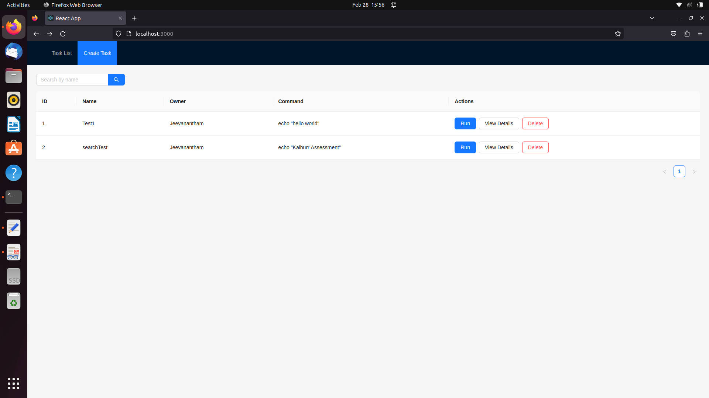
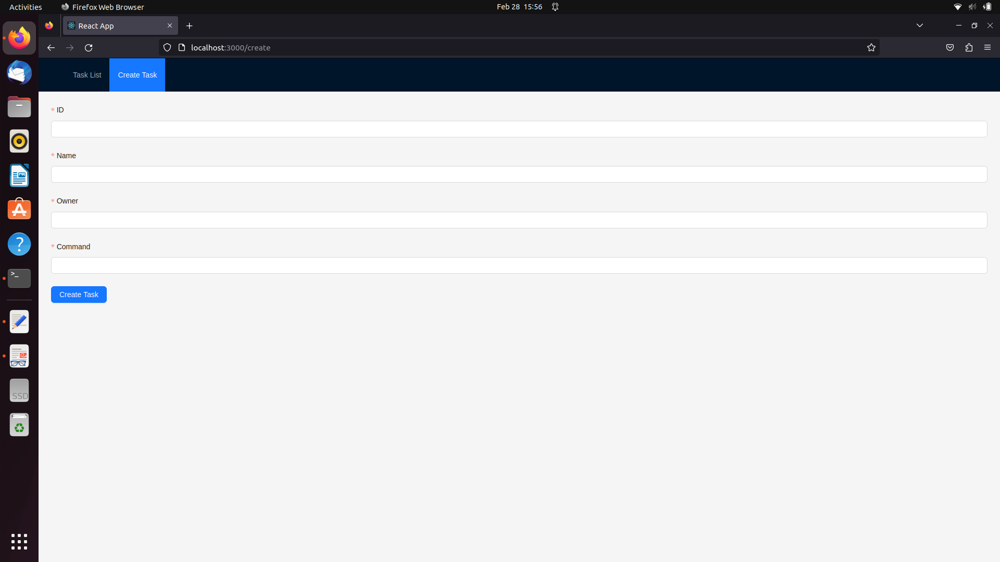
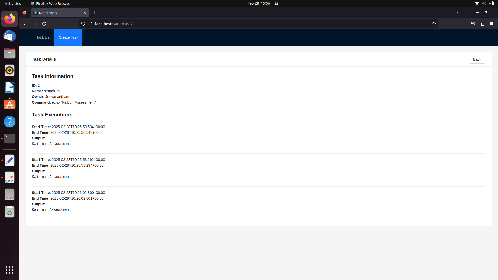
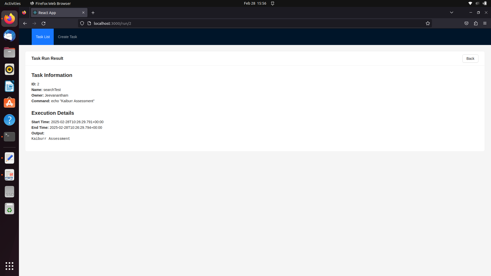
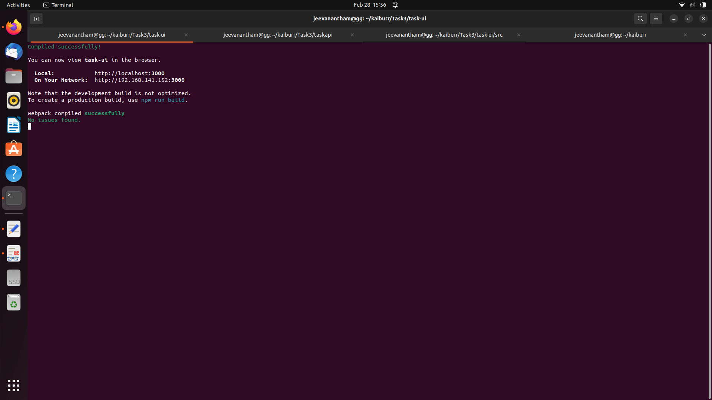
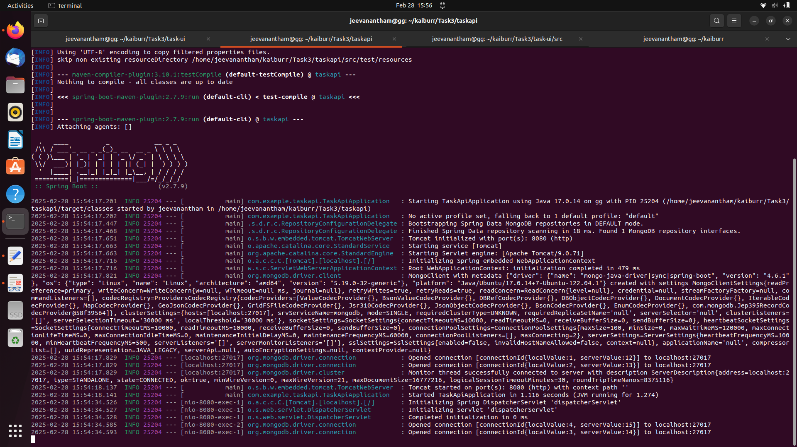

# Task UI Application

This is the frontend web UI for the Task API application. It is built using React 19 with TypeScript and Ant Design. The UI supports creating tasks, viewing the task list, searching, deleting tasks, running commands, and viewing execution results on dedicated pages.

## Features

- **Task List Page:** Displays a list of tasks with actions to Run, View Details, or Delete.

- **Create Task Page:** Provides a form to create new tasks.

- **Task Detail Page:** Shows full task information including execution history.

- **Run Result Page:** Displays the execution result (start time, end time, and output) when a task is run.

## Prerequisites

- **Node.js** (v18 or later) and **npm** (v10.8.2 or later)
- The Task API backend must be running (refer to Task 1 for backend setup).

# Application Setup

## Frontend

### Install Frontend Dependencies

    npm install

### Run the Frontend Application
    
    npm start
    

    
The application will be available at http://localhost:3000.

## Backend

### Install API Backend Dependencies

    mvn clean install
    
### Run the Task API Backend

    mvn spring-boot:run
    

The API will be available at http://localhost:8080.

